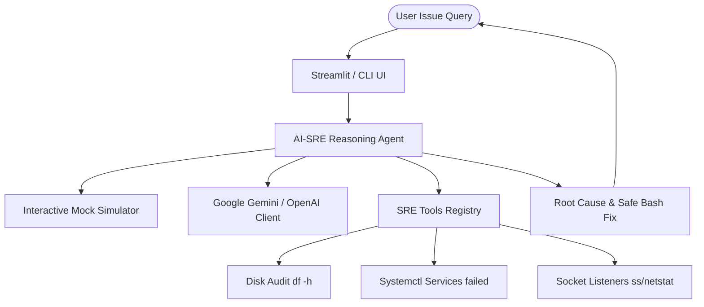

# AI-SRE: Autonomous Linux Troubleshooting Agent 🛡️

AI-SRE is a high-signal, premium, local-running diagnostics agent that automates incident response, diagnoses system failures, and recommends safe, audited Bash resolution scripts.

## 🚀 Key Features

*   **Structured Diagnostic Tools:** Python tools executing real systems analysis (Disk metrics, Systemd loops, networking socket bindings, process hogs).
*   **API & Mock Reasoning Loop:** Run real-time agent chains using **Google Gemini** or **OpenAI** APIs, or execute offline with **Simulated Interactive SRE Mode**.
*   **Stunning Interfaces:** Beautiful interactive Streamlit Web Dashboard and colorful command-line interface (`rich`-rendered CLI).

---

## 🏗️ Architecture Design



---

## 🛠️ Getting Started

### 1. Install Dependencies
```bash
pip install -r requirements.txt
```

### 2. Configure Environment (Optional for API keys)
Create a `.env` file in the root directory:
```env
GEMINI_API_KEY=your_gemini_key
# OR
OPENAI_API_KEY=your_openai_key
```

### 3. Launch the Interfaces
*   **Run Streamlit Web UI:**
    ```bash
    streamlit run app.py
    ```
*   **Run Interactive CLI:**
    ```bash
    python cli.py
    ```